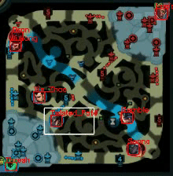
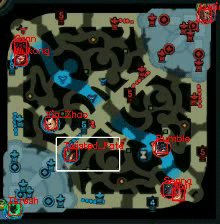
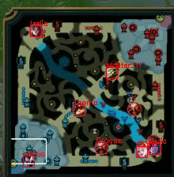

1. 각 챔피언의 프레임 당 위치 예측 모델 **성능 개선** (**JgPos v1.2**)
    - 챔피언 아이콘이 겹치는 경우에도 최대한 예측이 가능하도록 수정
    - **Center-cropping**: query icon의 크기를 조금씩 줄여가며 matching
    - **Portion matching**: occlusion된 경우를 고려하여 전체 icon 중 일부만 crop하여 matching
    - **HSV difference**: 단순히 SSIM만 고려하였을 때, 협곡의 지형과 챔피언 아이콘의 모양이 유사하여 매칭되는 경우가 있어 매칭된 영역과 챔피언 아이콘 사이의 HSV값을 추가적으로 비교
    
    ```python
    		# Get minimap part from the entire frame
        minimap = frame[map_y_min:map_y_max, map_x_min:map_x_max]
        minimap_clone = minimap.copy()
    
        # For each icon which exist in the current game
        for name, icon in icon_dict.items():
          matched = False
          crop_px = 0
    
          while not matched:
            # Center-cropping
            if crop_px > MAX_CENTER_CROP:
              break
            if crop_px > 0:
              icon_query = icon[crop_px:-crop_px, crop_px:-crop_px].copy()
            else:
              icon_query = icon.copy()
            
            # Resize query icon to specific size
            icon_mini = cv2.resize(icon_query, query_size)
    
            # Find the optimal position for the entire icon, and the top, bottom, left and right part
            for icon in [icon_mini, icon_mini[:CROP_PX], icon_mini[-CROP_PX:], icon_mini[:, :CROP_PX], icon_mini[:, -CROP_PX:]]:
              # Extract the dominant HSV color from the icon
              icon_HSV = cv2.cvtColor(cv2.resize(icon, (1,1)), cv2.COLOR_BGR2HSV).astype(np.float32)
              (tH, tW) = icon.shape[:2]
    
              # Find the matched region using the query icon as a template
              result = cv2.matchTemplate(minimap, icon, cv2.TM_CCOEFF_NORMED)
              scores = np.sort(result.reshape(-1))[::-1]
              
              # for top-k matched regions
              for score in scores[:top_k]:
                (yCoords, xCoords) = np.where(result == score)
    
                for x, y in zip(xCoords, yCoords):
                  # matched region comparison (HSV difference score and SSIM)
                  matched_part = minimap[y:y+tH, x:x+tW].copy()
                  matched_HSV = cv2.cvtColor(cv2.resize(matched_part, (1,1)), cv2.COLOR_BGR2HSV).astype(np.float32)
                  HSV_diff = np.mean(np.abs(icon_HSV - matched_HSV))
                  ssim = structural_similarity(icon, matched_part, multichannel=True)
    
                  # check the matched region is valid
                  if (HSV_diff < 10 and ssim > 0.35) or (HSV_diff < 25 and ssim > 0.7) or (HSV_diff < 15 and ssim > 0.55):
                    matched = True
                    cv2.rectangle(minimap_clone, (x, y), (x + tW, y + tH), (0, 0, 255), 1)
                    cv2.putText(minimap_clone, name, (x, y), cv2.FONT_HERSHEY_SIMPLEX, 0.3, (0,0,255))
                    break
                
                if matched:
                  break
              if matched:
                break
    
            # Center-cropping for one more pixel
            crop_px += 1
    ```
    
    - **결과 시각화 (위의 영상은 v1.2 아래는 비교를 위한 v1.1)**
        - v1.1에서는 occlusion이 있는 경우 (아래 예시에서 트리스타나, 오공에 주목)는 거의 잡아내지 못하였는데 전체 아이콘이 아닌 일부만 비교하는 방법을 통하여 성능 향상
        - 엉뚱한 곳에 잡히는 경우가 존재하여 false positive를 줄이기 위한 조건 추가 필요
        - 거의 모든 icon이 occlusion되어 시각적으로 확인하기 어려운 경우에는 이전 frame의 정보를 이용하여 해당 frame의 위치를 예측하는 과정 필요
        
        
        
        
        

2. 샘플 영상 추가 및 결과 시각화



3. 확률모델 학습을 위한 csv 파일 출력은 성능이 어느정도 개선되면 진행할 예정.
